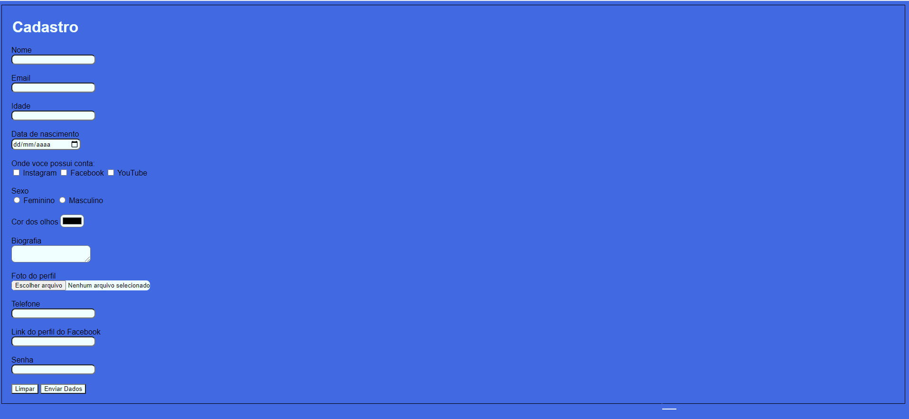

# Codeclub-class-challenge2-html
  

> Esse layout de cadastro foi feito com o intuiti de testar os conhecimentos e habilidades no HTML e CSS.
# Ajustes e melhorias

O projeto ainda está em desenvolvimento e as próximas atualizações serão voltadas nas seguintes tarefas:

- [ ] Responsividade
- [ ] Concluir com JavaScript
- [ ] Adicionar banco de dados

## 🤝 Colaboradores

Agradecemos às seguintes pessoas que contribuíram para este projeto:

<table>
  <tr>
    <td align="center">
      <a href="#">
         
        
          <b>Eudes Barbosa</b>
        
      </a>
    </td>
  </tr>
</table>

[⬆ Voltar ao topo](#Codeclub-class-challenge2-html) 
